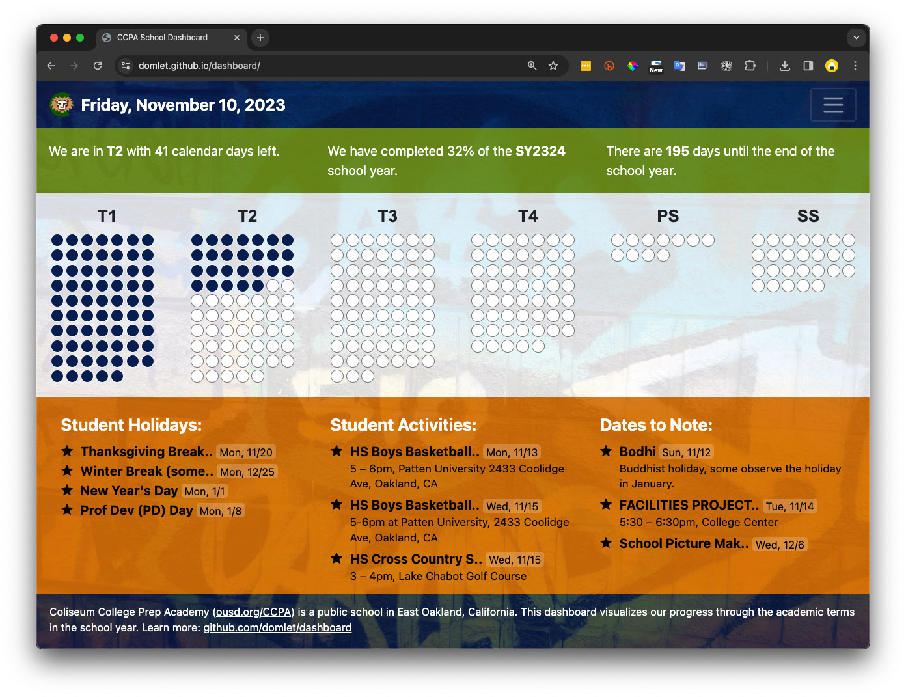

# dashboard

A visual dashboard to help teachers and students track time remaining in each academic term and the school year. Developed for Coliseum College Prep Academy in East Oakland. CCPA is a public 6-12th school in the Oakland Unified School District.

- See it live: https://domlet.github.io/dashboard

## Tech stack
- HTML, CSS, JavaScript, [Google Calendar API](https://developers.google.com/calendar/api/guides/overview)

## Legal 
- [Privacy Policy](https://github.com/domlet/dashboard/blob/main/privacy-policy.html)
- [Terms of Service](https://github.com/domlet/dashboard/blob/main/terms-of-service.md)
